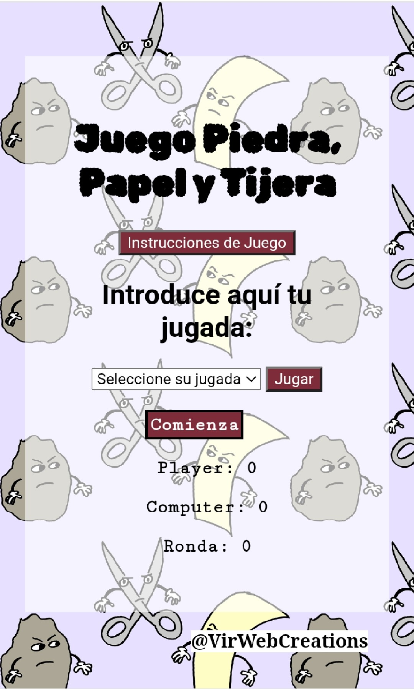

<h1 align="center"> PIEDRA, PAPEL o TIJERA - VirginiaAlvarezPerez </h1> 

  <h2 align="center">   ** 🪨 📜 ✂ **   </h2>

 Divertida aplicacion para jugar conrtra el ordenador a piedra, papel o tijera. 
 El ordenador sacará un número aletatorio del 1 al 9, según entre que valores se encuentre ese numero, se corresponderá con 🪨 piedra, con 📜 papel o con ✂.
 Elige tu elemento y pulsa jugar!! La aplicacion te dirá si ganas o pierdes en cada ronda, y se irán sumando los puntos de cada uno en el contador:

 ***
  ***
   

  
 Cada partida son 10 rondas, cada vez que pulsas  pasa una ronda. Al final de la partida, sabrás quien ha ganado!

Pulsa el botón de intrucciones si no lo tienes claro!

 A las 10 rondas, si quieres volver a jugar...RESETEA!!!

 

 @VirWebCreations 

